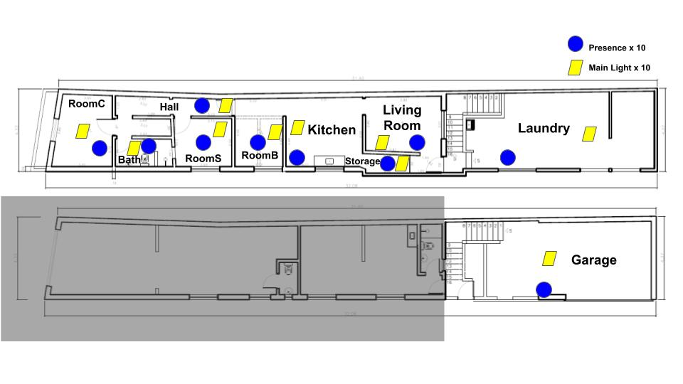
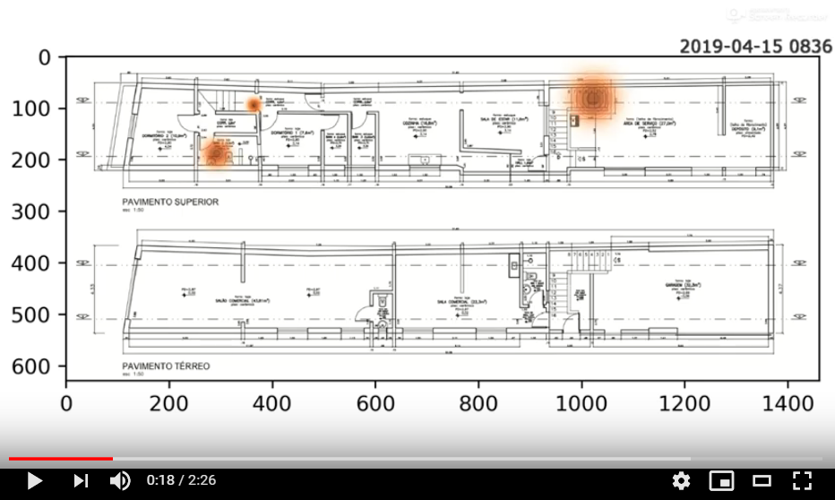

# Brazilian Smart Home Testbed #
Brazilian smart home dataset, integrating part of [Open Knowledge IoT Project (OKIoT)](https://github.com/vthayashi/OKIoT).

It constains data collected by datalogger module in a Brazilian household in 2019 August, 2019 September and 2019 October.

The raw data is available in folders 201908 (August), 201909 (September) and 201910 (October).

Preprocessed data of most frequent events of one moenth (2019 August) can be found in FrequentEvents.csv file.

## Data model ##

* Light state change and motion events are captured in each room by specific sensors and sent to datalogger module

* The datalogger module has a Real Time Clock (RTC).Upon event receival, the datalogger registers the event and its related UNIX timestamp.

## Sensors ##

Two sensors are installed in each room:

* Light State: light bulb state based on optocoupler sensor [datasheet](https://www.farnell.com/datasheets/73758.pdf).

* Motion: Passive InfraRed (PIR) sensor  [see more details](https://learn.adafruit.com/pir-passive-infrared-proximity-motion-sensor/overview).

The sensors relay events to datalogger module [see more details](https://github.com/vthayashi/OKIoT/tree/master/Datalogger) by Radio Frequency 433 MHz transmitters [see more details](http://www.energiazero.org/arduino_sensori/Complete%20Guide%20for%20RF%20433MHz%20Transmitter.pdf).

